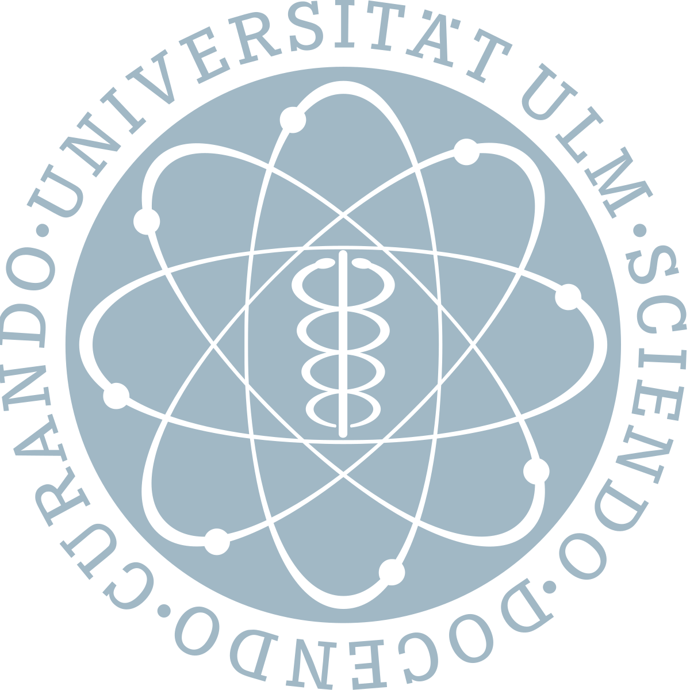

## Short CV

-------------------

### Education

10/2020-11/2022    {: align="right"}{: width="25%" }  

: **Master Studies** at Ulm University                                                     

   *Thesis: Surface and Mechanistic Studies for Electrochemical CO2-Reduction over CeO2* 

10/2017-10/2020    {: align="right"}{: width="25%" } 

: **Bachelor Studies** at Ulm University 

   *Thesis: DFT-Calculations of Diatomic Molecules on Pt-based Single Atom Alloys and Surface Layers*
