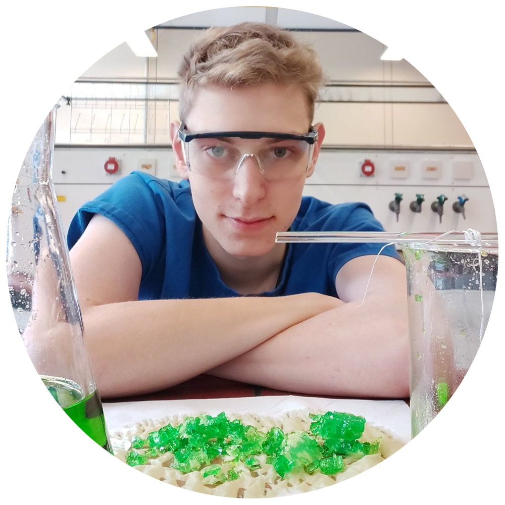

 ------------------------------
 
  ### Florian Keller - MSc. 
  
{: align="center"}{: width="25%" }  

**
 Theoretical and Experimental Chemist 
**
     
  
### Biography 

Florian obtained both his BSc. and MSc. at the University Ulm in Baden-Württemberg, Germany. During the time of his studies he gained impressions in both theoretical modeling and experimental applications and analysis methods. He was particularly interested in new methods for sustainable CO2 reduction and artificial photosynthesis. These topics are among the most important issues of our modern times and it takes both the experience of a theoretician and the knowledge of an experimental chemist to find long-term solutions to these problems on a large scale. 
 
Away from his studies, Florian was active in the university's departmental representative committee at the time of his studies and has served on numerous university policy committees during this time. 
 
In addition, Florian was active as the drummer of the UniBigband for over five years and grows his own crystals in his spare time. You can find more information in the  [blog](https://florianmkeller.github.io/blog/ "link").
 
 <a href="https://florianmkeller.github.io/blog/">blog</a>
