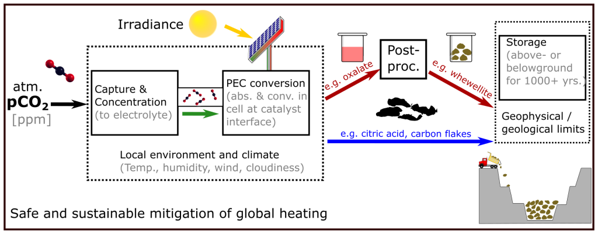

--------------------------------------------
# Current Projects

&emsp;

# Past Projects
{: align="right"}{: width="15%" } 
## NETPEC

NETPEC stands for “**N**egative **E**mission **T**echnologies based on **P**hoto**E**lectro**C**hemical Methods” and is a collaborative research project funded by the BMBF.  The overall goal of the NETPEC project is the development of highly efficient photoelectrochemical approaches to convert carbon dioxide into easily storable, safe and sustainable carbon sink products. This is accompanied by climate modeling, geological reservoir investigations and sustainability analysis, thus making the NETPEC project follow a holistic approach.

During the time of my master thesis I was a part of this joint project regarding the modelling of possible CO2-reduction reactions over CeO2 surfaces. 
Learn more:   [NEPTEC.org](https://netpec.org/ "Link")

{: align="center"}{: width="100%" }

 

Principle of terrestrial photoelectrochemical carbon sinks. Atmospheric CO2 is captured into an electrolyte and converted to carbon-rich products in a cell using directly absorbed solar radiation. While some products (e.g., oxalate) may require postprocessing, others could be directly extracted for long-term storage (e.g., carbon flakes). The local climatic environment impacts the efficiency and conversion rate of the system, the storage potential depends on the product due to potential geochemical interactions between storage site and sink product.
(https://doi.org/10.1002/aenm.202103801)

    
 

&emsp;

